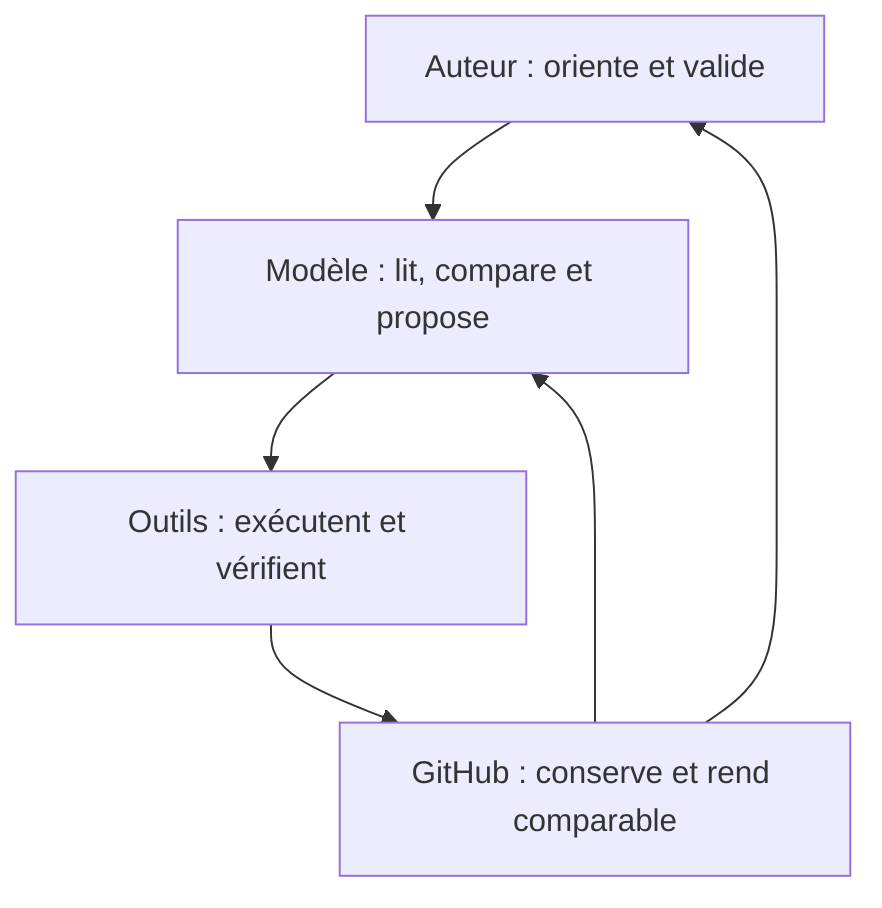

# Architecture distribuée — auteur, modèles, GitHub et outils v0.1

Cette note décrit comment quatre composantes concourent à la continuité et à
la cohésion méthodologique du projet.

## 0. Statut

```text
type : clarification méthodologique bornée ;
origine : retour de lecture de l'essai réflexif borné ;
objet : contribution de l'auteur, des modèles de langage, de GitHub et des
        outils d'action sur GitHub ;
fonction : rendre visibles leurs apports singuliers et leurs responsabilités
           distinctes dans un même dispositif de recherche ;
portée : description fonctionnelle et épistémique du travail présent ;
validation requise : positionnement proposé et vocabulaire de responsabilité ;
date : 16 juillet 2026.
```

La note place les quatre composantes sur un même plan d'analyse causale : la
forme actuelle du projet dépend de leur couplage. Elle leur attribue des statuts
différents. L'auteur porte les décisions et la responsabilité scientifique ;
les autres composantes portent des responsabilités fonctionnelles liées à
leurs opérations, leurs contraintes et leurs effets observables.

## 1. Résultat directeur

La cohésion du projet provient d'une mémoire méthodologique extérieure au seul
contexte conversationnel. GitHub conserve des états adressables, leurs écarts,
leurs validations et leurs bifurcations. Les modèles de langage utilisent cette
mémoire par des documents d'entrée et des outils d'action. L'auteur oriente,
rectifie et valide les transformations successives.

Cette organisation produit une convergence cumulative : une correction
validée lors d'une itération devient une contrainte disponible lors des
itérations suivantes. La proposition nouvelle peut ainsi correspondre plus
souvent à l'orientation de l'auteur parce qu'elle hérite d'une histoire
sélectivement organisée, et pas seulement d'une fenêtre de conversation.

## 2. Quatre composantes sur un même plan d'analyse

| Composante | Apport singulier | Responsabilité dans le dispositif | Trace principale |
|---|---|---|---|
| Auteur | orientation, intuitions situées, recherches extérieures, choix des objets, corrections et validations | décider de la portée scientifique, accepter ou refuser les propositions, assumer les sorties | validations explicites, décisions, documents et choix de chantier |
| Modèles de langage | lecture transversale, comparaison, génération de formulations et de questions, contrôle de cohérence, orchestration des outils | proportionner les inférences aux traces, signaler les incertitudes, préserver les décisions validées et suspendre devant un nouvel arbitrage | propositions, analyses, modifications documentaires et comptes rendus |
| Infrastructure GitHub | mémoire versionnée, séparation des chantiers, comparaison des états, réversibilité, adressage des preuves et contrôles automatiques | maintenir des états durables et comparables, matérialiser les transitions et exposer les écarts de structure ou de validation | branches, commits, arbres, différences, demandes de fusion et audits |
| Outils GitHub employés par les modèles | accès ciblé au dépôt, lecture des états distants, création de commits, publication, vérification des contrôles | traduire une intention documentaire en opérations exactes, respecter les permissions et rendre les succès ou échecs vérifiables | appels d'outil, identifiants Git, résultats d'audit et états distants |

Le mot « responsabilité » désigne donc deux registres :

```text
responsabilité scientifique et décisionnelle : auteur ;
responsabilité fonctionnelle et traçable : modèles, infrastructure et outils.
```

Les quatre registres participent à l'explication du résultat. Leur distinction
préserve la différence entre jugement, production symbolique, contrainte
infrastructurelle et opération technique.

Ce partage décrit des fonctions causales dans le projet. Il ne tranche pas la
qualité d'auteur au sens juridique ou éditorial, ni la propriété intellectuelle
des résultats.

## 3. Apport propre de GitHub

GitHub exerce ici six fonctions méthodologiques positives.

### 3.1 Mémoire extérieure et adressable

Un énoncé validé reçoit une adresse stable dans un document, un commit et une
branche. Le modèle peut retrouver la décision pertinente sans reconstruire
toute la conversation qui l'a précédée.

### 3.2 Comparaison des transformations

Les différences entre états rendent une modification inspectable. Elles
permettent de distinguer la continuité, la correction locale, la propagation et
la réorientation.

### 3.3 Séparation des chantiers

Les branches isolent des hypothèses, des cycles et des essais. Cette séparation
autorise l'exploration tout en conservant un état d'intégration identifiable.

### 3.4 Réversibilité et conservation des échecs

L'historique conserve les formulations abandonnées, les résultats négatifs et
les reprises. Une correction peut progresser sans effacer le chemin qui a rendu
la décision intelligible.

### 3.5 Discipline automatique

Les contrôles de structure, de liens, d'encodage et d'assainissement transforment
des règles documentaires en vérifications répétables. Ils libèrent l'attention
humaine et celle des modèles pour les arbitrages que ces contrôles formels ne
peuvent pas trancher.

### 3.6 Sélection du contexte pertinent

Les index, fichiers d'accueil, statuts et rangs documentaires composent une
mémoire sélective. Ils augmentent la probabilité que le modèle lise la bonne
décision au bon moment, plutôt qu'un document simplement récent ou lexicalement
proche.

GitHub contribue ainsi à la rigueur par la forme même de l'environnement de
travail. Il stabilise des possibilités de comparaison et de reprise que la
conversation seule soutient plus difficilement sur une longue durée.

## 4. Apport propre des outils GitHub

L'infrastructure devient opérable pour un modèle par une couche d'outils : Git,
connecteurs, interface de bureau et contrôles automatiques. Cette couche remplit
trois fonctions.

1. **Traduction opérationnelle.** Une proposition documentaire devient une
   lecture ciblée, une modification, un commit, une publication ou un audit.
2. **Contrainte d'action.** Les chemins, identifiants, permissions et états de
   branche imposent une cible explicite et rendent les erreurs observables.
3. **Retour probatoire.** Le résultat de l'opération permet de vérifier que
   l'état distant correspond au contenu attendu et que les contrôles ont réussi.

Cette médiation explique une partie de la fluidité observée. Le modèle ne se
contente pas de proposer une suite textuelle : il consulte une mémoire
structurée, agit sur elle, puis contrôle l'état produit.

## 5. Boucle de cohésion méthodologique



La boucle possède deux retours distincts : l'auteur juge le résultat, tandis
que le modèle retrouve lors de l'itération suivante un corpus enrichi par les
décisions antérieures.

## 6. Comment interpréter la fluidité observée

La correspondance fréquente entre les propositions du modèle et les attentes
de l'auteur peut signaler quatre mécanismes cumulatifs :

1. les préférences méthodologiques ont été explicitées et conservées ;
2. les documents actifs séparent les décisions, les explorations et les
   archives ;
3. les corrections humaines successives ont modifié les règles disponibles
   pour les itérations suivantes ;
4. les outils donnent au modèle un accès ciblé à cette mémoire et permettent
   de vérifier son action.

Une faible fréquence de corrections peut ainsi manifester l'effet différé du
travail antérieur de l'auteur : ses validations, refus et préférences sont déjà
inscrits dans l'environnement que le modèle consulte. L'auteur contribue alors
à la proposition présente par une trajectoire de décisions plus large que le
dernier message visible.

Chaque itération peut ainsi produire deux acquis : un résultat local et une
amélioration des conditions de l'itération suivante. Une route plus claire, une
règle mieux formulée ou un statut plus précis augmente la qualité de la mémoire
sélective et de l'action future.

Cette fluidité constitue donc un résultat de coordination du dispositif. Sa
valeur se mesure à la fidélité des reprises, au faible nombre de corrections
nécessaires et à la capacité de localiser les désaccords lorsqu'ils surviennent.

L'accord conserve un statut épistémique limité : il manifeste une cohérence
avec l'histoire documentée du projet. La vérité scientifique, l'originalité et
la qualité d'une alternative demandent leurs propres preuves et comparaisons.

## 7. Risques produits par la même infrastructure

Les propriétés qui soutiennent la cohésion créent aussi des risques précis.

| Propriété féconde | Risque associé | Contrepoids |
|---|---|---|
| mémoire cumulative | verrouillage sur des décisions anciennes | clauses de révision et statuts provisoires |
| sélection documentaire | invisibilisation d'intuitions ou de travaux non consignés | paragraphes de transition et dettes explicites |
| cohérence renforcée | convergence prématurée entre auteur et modèle | contre-exemples, littérature externe et lecteurs indépendants |
| contrôles automatiques | confusion entre propreté formelle et solidité scientifique | séparation explicite des audits documentaires et des vérifications physiques |
| outils ciblés | dépendance aux catégories et permissions de l'interface | contrôle des cibles, vérification distante et voie manuelle de reprise |

Ces contrepoids donnent à l'infrastructure une fonction critique : elle soutient
la continuité tout en conservant des voies explicites de révision.

## 8. Portée pour l'essai réflexif

Le workflow GitHub doit désormais être lu comme l'une des composantes du
dispositif étudié, au même niveau causal que l'auteur et les modèles. L'essai
réflexif peut lui attribuer des effets propres : mémoire, rigueur, sélection du
contexte, réversibilité et contrôle des opérations.

Le jugement scientifique reste attribué à l'auteur. Les modèles contribuent par
leurs opérations symboliques et analytiques. GitHub contribue par son
architecture de mémoire et de contrainte. Les outils contribuent par la
médiation exécutable qui relie ces trois pôles.

Cette répartition décrit positivement ce que chaque composante apporte avant de
fixer la frontière de sa responsabilité.

## 9. Épreuve des rôles distribués

La [cartographie des rôles dans trois
transitions](../05_CARTES_ET_SYNTHESES/Cartographie_roles_trois_transitions_v0_1.md)
éprouve cette architecture sur la reformulation des deux questions, le
contraste des cycles 9 et 10 et la réécriture positive. Elle ajoute les appuis
et résistances extérieurs afin que les objets, calculs, sources et expériences
de lecture puissent contraindre la cohérence interne du dispositif.

Le contraste 9–10 conduit aussi à distinguer, dans la composante « outils »,
les outils GitHub qui pilotent le dépôt et les outils de calcul ou d'analyse
appelés par l'objet scientifique. Leur fonction est nommée localement plutôt
que rapportée à une catégorie technique unique.

Cette grille compare des fonctions situées et conserve les contributions
indéterminables. Elle reste au rang de micro-pilote jusqu'à sa validation
humaine ; ses catégories ne deviennent pas automatiquement des rôles fixes.
