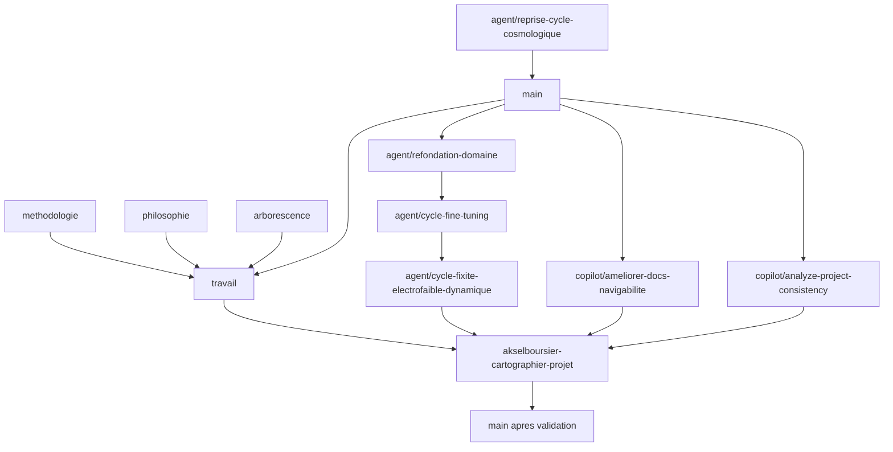

# Registre des branches du corpus v0.1

## Fonction

Ce registre distingue les branches Git des couches documentaires du corpus.
Il conserve la genealogie des chantiers sans faire d'une branche ancienne un
etat de travail implicite.

Le statut de contenu se lit dans les README, les index et les syntheses. Le
present document repond seulement aux questions suivantes :

```text
quelle branche a porte quel chantier ;
ou son contenu est-il maintenant visible ;
et quel est son statut dans l'integration courante ?
```

## Regle de lecture

```text
main : tronc valide apres revue ;
branche thematique : chantier borne, conserve jusqu'a son integration ;
travail : espace d'integration quotidien, resynchronise depuis main ;
branche de recuperation : integration exceptionnelle de branches deja
divergentes, soumise a revue avant de rejoindre main.
```

## Carte de consolidation



## Registre des branches

| Branche | Role | Contenu principal | Statut dans l'integration |
|---|---|---|---|
| `origin/agent/reprise-cycle-cosmologique` | Heritage | Reprise ancienne du cycle cosmologique | Ancetre deja present dans `main` |
| `origin/methodologie` | Chantier methodologique | Reecriture positive, protocoles et workflow | Integree dans `travail`, puis dans la recuperation |
| `origin/philosophie` | Chantier philosophique | `06_PHILOSOPHIE`, situations, tests et livrables | Integree dans `travail`, puis dans la recuperation |
| `origin/arborescence` | Navigation documentaire | Index supplementaire et raccords de structure | Integree dans `travail`, puis dans la recuperation |
| `origin/travail` | Integration precedente | Union methodologie, philosophie et raccords ulterieurs | Integree dans la recuperation; a resynchroniser apres validation de `main` |
| `origin/agent/refondation-domaine` | Refonte conceptuelle | Cadre canonique, cas sentinelles et architectures relationnelles | Integree par le sommet de sa chaine |
| `origin/agent/cycle-fine-tuning` | Cycle thematique | Cas de fine-tuning et ponderation weakless | Integree par le sommet de sa chaine |
| `origin/agent/cycle-fixite-electrofaible-dynamique` | Cycle thematique | Modeles, calculs et resultats de fixite electrofaible | Sommet de la chaine integree |
| `origin/copilot/ameliorer-docs-navigabilite` | Navigation | Grille des huit modes, audit taxonomique, conventions et renommage des architectures | Ancetre de la branche de recuperation |
| `origin/copilot/analyze-project-consistency` | Audit | Audit de coherence, objections et suggestions | Integre sans conflit |
| `akselboursier-cartographier-projet` | Recuperation | Union des chantiers ci-dessus et migration documentaire | Candidat de revue vers `main` |

## Procedure apres validation

```text
1. Revoir la branche de recuperation comme un jalon documentaire.
2. La fusionner dans main par une pull request avec commit de merge.
3. Avancer travail vers main, sans reecriture d'historique.
4. Conserver les branches sources jusqu'a ce que leur suppression soit
   explicitement decidee.
5. Ouvrir les nouveaux chantiers depuis main et ne maintenir que les branches
   thematiques actives necessaires.
```

## Limite

Ce registre ne remplace ni les historiques Git, ni les index du corpus, ni les
documents scientifiques. Il ne qualifie pas le rang theorique d'un document;
il rend seulement sa provenance et son etat Git explicites.
