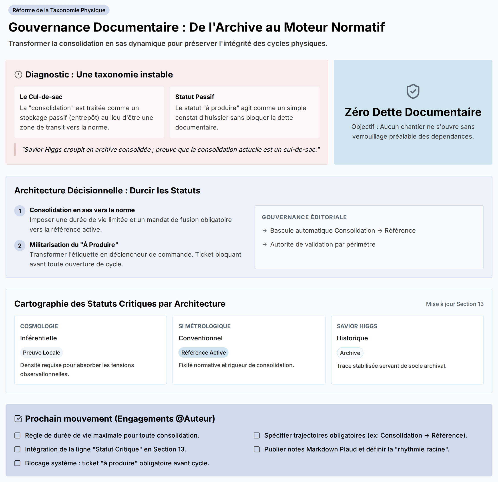

# Source DOCX - Critique_architecture_documentaire_v0_1

## Statut

```text
lot: 5 - critiques constructives
source physique: L’architecture_documentaire_des_constantes_physiques-Summary.docx
source physique path: 90_Critiques_ constantes_effectives_stabilisees/00_Sources_docx/L’architecture_documentaire_des_constantes_physiques-Summary.docx
sha256_source: 2b3338664f9afa6885ed9d701cac8cc6f06b8a9e6f7e9d7abe56ce279eb53b99
statut: extraction DOCX de travail
document actif concerne: Index; audit documentaire
controle attendu: Comparaison
```

## Limite

```text
Cette extraction ne remplace pas la source originale.
Elle rend la matiere lisible en Markdown pour comparaison et integration.
La mise en page Word, les equations, tableaux et elements graphiques
peuvent etre restitues de maniere incomplete.
```

> Verifier la source originale avant toute reprise scientifique.
> Convention : [CONVENTION_PLACEHOLDERS.md](../../CONVENTION_PLACEHOLDERS.md)

## Extraction

## L’architecture_documentaire_des_constantes_physiques

------------------------------------------------------------------------



## Synopsis central

La taxonomie analysée est puissante mais instable car elle confond la “consolidation” (actuellement traitée comme stockage) avec la “référence active” (norme vivante), maintient un statut “à produire” passif, et n’aligne pas les statuts documentaires sur la nature des architectures (inférentielle vs définitionnelle vs historique). Les commentateurs montrent que, sur le terrain, des architectures comme la cosmologie et la basse énergie demeurent en consolidation active sans basculer en référence, tandis que “Savior Higgs” croupit en archive consolidée; preuve que la consolidation, telle qu’écrite, n’est pas un sas vers la norme mais un cul-de-sac. Ils établissent que la robustesse épistémique varie: la cosmologie requiert une surabondance de “preuves locales” pour absorber les tensions de modèles; le SI métrologique, bloc conventionnel, dépend d’une consolidation/référence rigide; “Savior Higgs” tire sa stabilité d’un socle d’archive. L’enjeu est direct: sans requalification de la consolidation en mécanisme de montée en norme, sans militarisation du statut “à produire” comme déclencheur obligatoire des cycles, et sans corrélation explicite statut–architecture, le corpus devient un cimetière d’archives et perd sa dynamique d’intégration; nous devons transformer la gouvernance documentaire pour préserver l’intégrité des cycles physiques et la lisibilité méthodologique.

------------------------------------------------------------------------

## Architecture décisionnelle: durcir les statuts et aligner avec les architectures

### 1. Redéfinir la “consolidation” en sas vers la norme

- Diagnostic: La consolidation fonctionne comme entrepôt statique, créant une zone grise opérationnelle avec la référence active.
- Mécanisme correctif: Imposer que toute consolidation ait une durée de vie limitée et un mandat de fusion/édition vers la référence (ex.: “architecture métrologique du SI” doit produire une mise à jour de la référence globale).
- Critère de sortie: Une consolidation ne peut rester indéfiniment; elle doit soit monter en référence, soit être explicitement cantonnée à un périmètre où seule la consolidation est permise (architecture inter-familles spécifique).

### 2. Militariser le statut “à produire” (de l’inventaire à la commande)

- Diagnostic: Le statut “à produire” est une étiquette passive (constat d’huissier) malgré des lacunes critiques (ex.: notes Markdown pour Plaud NotePin, “rhythmie racine”).
- Réponse: Transformer “à produire” en déclencheur obligatoire avant l’ouverture de tout cycle/sous-cycle (ex.: théories effectives → readme auto-généré “à produire” avant travaux).
- Effet attendu: Zéro ouverture de chantier avec dette documentaire latente; le statut encadre, séquence, et verrouille les dépendances.

### 3. Corréler statut critique à la typologie d’architecture

- Constat: Les architectures ont des natures distinctes et donc des besoins statutaires différents.

- Cartographie ciblée:

  - Cosmologie (inférentielle): statut critique = “preuve locale” (granularité et densité pour absorber les tensions h0/λ et les mises à jour observationnelles).
  - SI métrologique (définitionnel/conventionnel): statut critique = “référence active”/“consolidation” (fixité normative).
  - Savior Higgs (historique/archival): statut critique = “archive historique” (trace, pas moteur).

<!-- -->

- Implémentation: Ajouter “Statut documentaire critique” dans la matrice transversale (section 13) pour chaque colonne d’architecture.

### 4. Gouvernance éditoriale: clarifier les frontières et les mandats

- Frontière durcie: Documenter, dans la section 3, les conditions de bascule consolidation → référence, les délais, et les autorités de validation.
- Mandat opérationnel: Chaque consolidation active porte un ticket de mise à jour planifiée; chaque “à produire” bloque l’ouverture de cycle tant que non résolu.

------------------------------------------------------------------------

## Prochain mouvement (Engagements)

**@Auteur du corpus**

- [ ] Ajouter à la section 3 une règle formelle: toute “consolidation” possède une durée de vie maximale (définir le délai) et doit générer une mise à jour de “référence active” ou être cantonnée explicitement à un périmètre non-référentiel - \[TBD\]
- [ ] Insérer dans la section 13 une ligne “Statut documentaire critique” et remplir pour Cosmologie (“preuve locale”), SI (“référence active/consolidation”), Savior Higgs (“archive historique”) - \[TBD\]
- [ ] Établir une procédure: génération automatique d’un ticket “à produire” (ex.: readme de sous-cycle) avant l’ouverture de tout nouveau cycle ou sous-cycle; ouverture bloquée tant que le ticket n’est pas clôturé - \[TBD\]
- [ ] Spécifier, pour chaque architecture interfamilles, le statut autorisé et la trajectoire obligatoire (ex.: consolidation → référence) avec critères d’éligibilité et autorité de validation - \[TBD\]
- [ ] Prioriser la documentation manquante critique: publier les notes Markdown pour Plaud NotePin et définir la “rhythmie racine” comme prérequis avant tout nouveau chantier connexe - \[TBD\]
