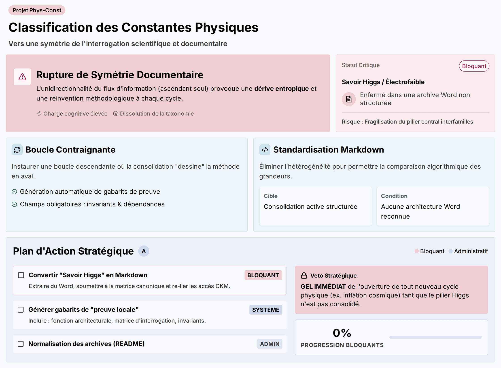

# Source DOCX - Critique_fiabiliser_hierarchie_v0_1

## Statut

```text
lot: 5 - critiques constructives
source physique: Fiabiliser_la_hiérarchie_des_constantes_physiques-Summary.docx
source physique path: 90_Critiques_ constantes_effectives_stabilisees/00_Sources_docx/Fiabiliser_la_hiérarchie_des_constantes_physiques-Summary.docx
sha256_source: f5fd6fb738b43fadd49acb678ffab0c9d360eea333acdca4c726b6794cf4e0b6
statut: extraction DOCX de travail
document actif concerne: Methode v1.3; carte v1.2
controle attendu: Comparaison
```

## Limite

```text
Cette extraction ne remplace pas la source originale.
Elle rend la matiere lisible en Markdown pour comparaison et integration.
La mise en page Word, les equations, tableaux et elements graphiques
peuvent etre restitues de maniere incomplete.
```

> Verifier la source originale avant toute reprise scientifique.
> Convention : [CONVENTION_PLACEHOLDERS.md](../../CONVENTION_PLACEHOLDERS.md)

## Extraction

## Fiabiliser_la_hiérarchie_des_constantes_physiques

------------------------------------------------------------------------



## Synthèse Centrale

Le projet de classification des constantes physiques est freiné par une asymétrie documentaire et une hétérogénéité de formats qui brisent la cohérence méthodologique: le flux d’information est strictement ascendant (des fiches de preuves locales vers les consolidations), les consolidations n’imposent aucune contrainte descendante, et une architecture centrale (“Savoir Higgs”/électrofaible) reste enfermée dans une archive Word non structurée tandis que les architectures SII effectives et cosmologiques sont en consolidation active Markdown. Les analystes démontrent que cette unidirectionnalité force les chercheurs à réinventer la méthode à chaque cycle (charge cognitive, entropie) et que l’hétérogénéité de formats dissout l’universalité de la taxonomie (impossibilité de comparer CKM vs α dans des bases différentes). L’enjeu est systémique: sans boucle bidirectionnelle et sans standardisation stricte en consolidation active, l’édifice interfamilles repose sur un pilier fragile, ce qui bloque la symétrie de l’interrogation scientifique et dilue les priorités vers des tâches triviales. Nous devons donc imposer une boucle documentaire descendante via des gabarits contraignants, convertir immédiatement l’archive fondatrice en notes Markdown normalisées, et re-hiérarchiser le statut “à produire” avec des tags de criticité bloquants pour protéger l’intégrité épistémologique du projet.

------------------------------------------------------------------------

## Architecture documentaire: de la faille unidirectionnelle à la boucle contraignante

- Le flux actuel

  - Les fiches de preuves locales (ex. paramètres H0, w cosmologique) alimentent les synthèses de consolidation.
  - Les consolidations finalisées n’injectent aucune contrainte formelle dans la production future de preuves locales.
  - Effet: réinvention méthodologique à chaque cycle, hausse de charge cognitive, dérive entropique.

<!-- -->

- La solution opératoire

  - Chaque consolidation validée doit générer automatiquement un gabarit de “preuve locale” contraignant (fichier template structuré).
  - Champs obligatoires: fonction architecturale, dépendances de modèles, invariants transversaux, matrice d’interrogation.
  - Logique: l’outil de stockage devient outil de production; la consolidation “dessine” la méthode en aval.

## Sécurisation des architectures interfamilles: éliminer l’hétérogénéité de formats

- État contrasté

  - SII (effectives basse énergie) et cosmologique: notes Markdown, consolidation active, modularité et versioning.
  - “Savoir Higgs”/électrofaible: archive historique Word, narrative libre, sous-dossier, absence de structure algorithmique.

<!-- -->

- Risque

  - Rupture d’universalité: impossible de comparer des grandeurs si l’une vit en Markdown structuré et l’autre dans un bloc narratif.
  - Pilier central fragilisé: l’architecture interfamilles perd sa robustesse.

<!-- -->

- Remède

  - Prérequis absolu: aucune architecture interfamilles reconnue sans consolidation active au format Markdown, sans exception.
  - Conversion disciplinée: extraire “Savoir Higgs” du Word, le soumettre à la matrice canonique, identifier les invariants, re-lier les dépendances et accès (ex. CKM, électrofaible) dans une structure interrogable.

## Priorisation éditoriale: “À produire” doit cesser de diluer l’urgence scientifique

- Problème

  - Liste plate mêlant tâches épistémologiques majeures et tâches administratives mineures avec le même rang visuel.
  - Biais humain vers la trivialité (dopamine rapide): tri de fichiers vs consolidation des piliers.

<!-- -->

- Réponse

  - Scinder “À produire” avec des étiquettes de criticité:

    - “à produire-bloquant”: notes fondatrices (ex. Savoir Higgs) qui conditionnent l’ouverture de tout nouveau cycle.
    - “à produire-administratif”: tâches différables (README, normalisation d’archives).

  <!-- -->

  - Effet: énergie focalisée sur les urgences méthodologiques, coupe-circuit des cycles tant que les piliers ne sont pas consolidés.

------------------------------------------------------------------------

## Prochaines Actions

**@Auteur principal**

- [ ] Générer un gabarit contraignant de “preuve locale” à partir de chaque consolidation active existante (inclure champs: fonction architecturale, dépendances de modèles, invariants, matrice d’interrogation) - \[TBD\]
- [ ] Convertir la note Word “Savoir Higgs” en une note Markdown de consolidation active, structurée par la matrice canonique (identifier invariants, formaliser accès et dépendances, supprimer narratif non-structuré) - \[TBD\]
- [ ] Implémenter un système d’étiquettes de criticité pour le statut “À produire” (créer “à produire-bloquant” et “à produire-administratif”; classer chaque tâche existante) - \[TBD\]
- [ ] Geler l’ouverture de nouveaux cycles physiques (ex. inflation cosmique) tant que “Savoir Higgs” n’est pas consolidé en Markdown et taggé “à produire-bloquant: résolu” - \[TBD\]
