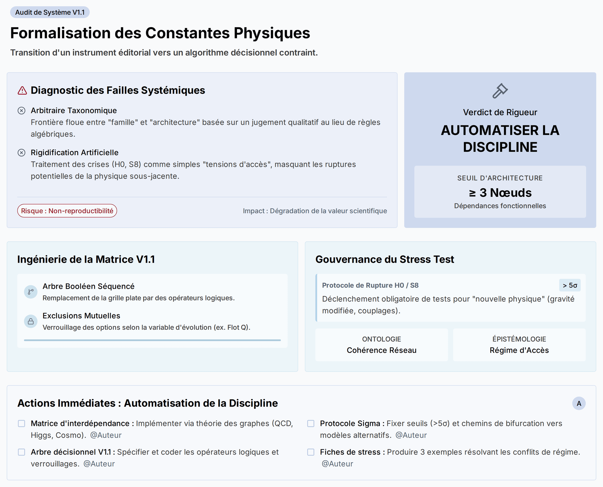

# Source DOCX - Critique_mathematiser_classification_v0_1

## Statut

```text
lot: 5B - critiques constructives supplementaires
source physique: Mathématiser_la_classification_des_constantes_physiques-Summary.docx
source physique path: 90_Critiques_ constantes_effectives_stabilisees/00_Sources_docx/Mathématiser_la_classification_des_constantes_physiques-Summary.docx
sha256_source: d42bfe333d3c4ad7babb4a5deb54c66836dccab10b67e8d0dec04e47f55a3ede
statut: extraction DOCX de travail
document actif concerne: Formalisation prudente; graphes; seuils; decision
controle attendu: Criblage lot 2
```

## Limite

```text
Cette extraction ne remplace pas la source originale.
Elle rend la matiere lisible en Markdown pour comparaison et integration.
La mise en page Word, les equations, tableaux et elements graphiques
peuvent etre restitues de maniere incomplete.
```

> Verifier la source originale avant toute reprise scientifique.
> Convention : [CONVENTION_PLACEHOLDERS.md](../../CONVENTION_PLACEHOLDERS.md)

## Extraction

## Mathématiser_la_classification_des_constantes_physiques

------------------------------------------------------------------------



## Synthèse Centrale

Le cadre proposé pour classifier les constantes physiques échoue sur un point cardinal: l’absence de formalisme contraignant transforme une taxonomie ambitieuse en instrument éditorial, exposé à la circularité et à l’arbitraire. L’équipe d’analyse établit que trois failles systémiques se nourrissent mutuellement: une démarcation floue entre “famille” et “architecture” basée sur jugement qualitatif; un traitement des crises cosmologiques (H0, S8) relégué à de simples “tensions d’accès” qui prolongent artificiellement la macro-architecture; et une “matrice canonique V1.1” exhaustive mais non décisionnelle, incapable de résoudre les conflits de critères. La preuve se matérialise par des cas concrets (Higgs/Yukawa, échelle QCD, CMB vs lensing) où l’absence de règles algébriques, seuils de rupture et exclusions mutuelles permet des classements contradictoires. Les enjeux sont clairs: sans critères topologiques, protocoles de fracture et algorithmes hiérarchisés, le système perd reproductibilité, masque des ruptures potentielles de physique sous-jacente et mine sa vocation de guide pour la théorie; nous devons imposer la discipline formelle et retirer le libre arbitre là où il est physiquement insensé.

## Reconstruction Logique Orientée Décision

### Formaliser la “solidarité fonctionnelle” en critère algébrique

- Problème: La frontière “famille” vs “architecture” repose sur appréciation éditoriale.
- Mécanisme attendu: Théorie des graphes + matrices de dépendance fonctionnelle.
- Règle proposée: Un nœud critique (ex. valeur moyenne du vide électrofaible) dont la suppression annule le sens physique d’au moins trois nœuds connectés (masses fermioniques, angles CKM, textures Yukawa) franchit le seuil d’architecture. Passage formel et falsifiable.

### Instituer des “points de rupture” pour les sous-réseaux cosmologiques

- Problème: Les divergences fortes (H0, S8) sont traitées comme tensions d’accès, préservant la macro-architecture par défaut.
- Principe: Découpler robustesse ontologique (cohérence du sous-réseau) du réseau d’accès épistémique (CMB, lensing, amas).
- Protocole: Définir seuils sigma contraignants (ex. \>5σ entre CMB précoce et lensing tardif) déclenchant une obligation procédurale: tester hypothèses de nouvelle physique (modification de la gravité, nouveaux couplages) au lieu de rigidifier les constantes dans l’architecture existante.

### Transformer la Matrice Canonique V1.1 en algorithme décisionnel hiérarchisé

- Problème: Grille descriptive plate, poids équivalents, conflit non résolu entre champs (régime d’accès vs stabilisation).

- Solution: Arbre booléen séquencé avec opérateurs logiques et exclusions mutuelles.

  - Exemples:

    - “Si variable d’évolution = Q (flot d’échelle dynamique), alors ‘famille = convention’ est verrouillée; ‘convention’ non sélectionnable.”
    - “Si ‘fonction architecturale = fond’, alors ‘famille fonctionnelle’ subit test restrictif pour exclure ‘relations non qualifiées’.”

<!-- -->

- Effet: Reproductibilité inter-théoriciens, élimination du choix arbitraire, cohérence systémique.

### Gestion du stress test cosmologique: du diagnostic à la gouvernance

- Statut: Bon découpage en sous-réseaux (fond/expansion, budget normalisé, croissance).
- Lacune: Aucune logique de “survie du modèle” liée aux routes d’inférence.
- Remède: Cartographier incompatibilités inter-régimes et intégrer triggers d’éclatement à la matrice (seuils, chemins de bifurcation vers modèles alternatifs).

### Risque opérationnel: circularité et non-reproductibilité

- Symptomatologie: Classements contradictoires selon l’utilisateur; architecture maintenue malgré incohérences de données.
- Impact: Dégradation de la valeur scientifique (non falsifiabilité pratique), confusion des familles et architectures, retard dans la détection de nouvelle physique.

### Verdict de rigueur: “Automatiser la discipline”

- Synthesis: Le système doit être mathématiquement testable, algorithmiquement contraint et doté de seuils de fracture; autrement, il reste un cadre éditorial sophistiqué, non un outil de décision théorique.

## Prochain Mouvement (Engagements d’Action)

**@Auteur (Concepteur du cadre)**

- [ ] Implémenter une matrice d’interdépendance (graphes) pour au moins trois secteurs (Savoy-Higgs, QCD basse énergie, Cosmologie: fond/croissance) et publier la règle de seuil (≥3 nœuds annulés) pour qualifier “architecture” - \[TBD\]
- [ ] Spécifier et coder un arbre de décision pour la Matrice V1.1 avec opérateurs logiques, exclusions mutuelles et verrouillages d’options (inclure les cas: flot d’échelle Q, “fonction = fond”) - \[TBD\]
- [ ] Définir un protocole de rupture cosmologique: fixer seuils sigma (proposition initiale: \>5σ) et chemins obligatoires de test de nouvelle physique (liste minimale d’hypothèses à évaluer) pour les sous-réseaux H0 et S8 - \[TBD\]
- [ ] Documenter la séparation ontologique vs épistémique: publier critères formels de robustesse du sous-réseau indépendants des régimes d’accès (CMB, lensing, amas) - \[TBD\]
- [ ] Fournir un jeu d’exemples worked-out (3 fiches complètes) montrant la matrice décisionnelle en conflit résolu (ex.: “régime d’accès = dynamique” vs “stabilisation = convention”) - \[TBD\]
