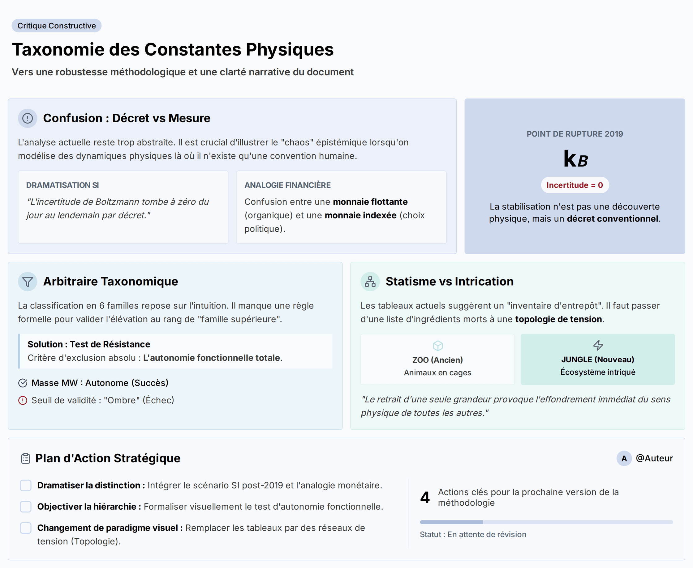

# Source DOCX - Critique_taxonomie_fonctions_v0_1

## Statut

```text
lot: 5 - critiques constructives
source physique: Taxonomie_des_constantes_comme_fonctions-Summary.docx
source physique path: 90_Critiques_ constantes_effectives_stabilisees/00_Sources_docx/Taxonomie_des_constantes_comme_fonctions-Summary.docx
sha256_source: a3d65843edba2df6b175fb2c308ebc40ebb71005a71b60e1d890b5bac9dfce42
statut: extraction DOCX de travail
document actif concerne: Methode v1.3; architectures
controle attendu: Comparaison
```

## Limite

```text
Cette extraction ne remplace pas la source originale.
Elle rend la matiere lisible en Markdown pour comparaison et integration.
La mise en page Word, les equations, tableaux et elements graphiques
peuvent etre restitues de maniere incomplete.
```

> Verifier la source originale avant toute reprise scientifique.
> Convention : [CONVENTION_PLACEHOLDERS.md](../../CONVENTION_PLACEHOLDERS.md)

## Extraction

## Taxonomie_des_constantes_comme_fonctions

------------------------------------------------------------------------



Cet échange est une critique constructive d’un texte méthodologique proposant une nouvelle taxonomie des constantes physiques. Les intervenants identifient trois faiblesses conceptuelles et narratives majeures et suggèrent des améliorations concrètes pour renforcer la robustesse, l’applicabilité et la clarté du document, notamment en utilisant des scénarios de dramatisation, un test de résistance formel et une représentation dynamique des interactions entre constantes.

------------------------------------------------------------------------

## Problème 1 : La Confusion entre Décret Conventionnel et Mesure Empirique

Cette section aborde la critique principale selon laquelle le texte, bien qu’il établisse une distinction brillante entre le **régime de définition physique** (l’existence brute d’une grandeur) et le **régime d’accès épistémique** (sa mesure humaine), échoue à démontrer le danger concret de leur confusion. Les intervenants estiment que l’analyse reste trop abstraite et confinée à une “tour d’ivoire analytique”, sans jamais illustrer les conséquences pratiques et le “chaos” qui survient lorsque cette distinction est ignorée. Le risque souligné est qu’un physicien, en traitant une valeur fixée par convention comme une mesure empirique, pourrait se mettre à “modéliser des illusions” en cherchant des dynamiques physiques là où il n’existe qu’un “décret humain”.

Pour remédier à cela, il est suggéré de “dramatiser” cette distinction à travers un exemple concret et puissant : la **redéfinition du Système International (SI) de 2019**. Le texte devrait contraster de manière frappante la réalité de la **constante de Boltzmann (kB)** avant 2019 (un “cauchemar expérimental” nécessitant une stabilisation empirique acharnée) et après, lorsque sa valeur a été figée par décret, faisant tomber son incertitude à zéro du jour au lendemain. Une expérience de pensée est proposée : un théoricien du futur, sans contexte métrologique, pourrait conclure à une découverte physique phénoménale (“l’entropie microscopique de l’univers s’est soudainement cristallisée”) face à cette stabilisation, alors qu’il s’agit d’une simple convention. Pour renforcer ce point, une **analogie avec le monde financier** est avancée, comparant la confusion à celle entre une **monnaie flottante** (organique, chaotique, stabilisée empiriquement) et une **monnaie indexée** par décret gouvernemental, dont la stabilité n’est pas le reflet d’une économie miraculeuse mais d’un choix politique.

------------------------------------------------------------------------

## Problème 2 : L’Arbitraire dans la Hiérarchisation des Familles de Constantes

Ce segment se concentre sur la méthode de classification des constantes en six “familles supérieures” proposées par l’auteur (Couplage, Échelle, Relation, Raccordement, Orientation et Convention). Bien que cette synthèse soit qualifiée de “prouesse” et de “tour de force” pour nettoyer le désordre existant, la critique porte sur le mécanisme utilisé pour déclasser les anciennes catégories (comme celle de “seuil”) pour les transformer en **fonctions transverses**. Ce processus est jugé **arbitraire**, reposant sur l’intuition de l’auteur plutôt que sur une logique implacable et systématique. La faiblesse majeure est l’absence d’une règle formelle permettant à un autre chercheur d’appliquer la méthode à l’aveugle et de déterminer si une nouvelle grandeur est une nouvelle famille ou un simple rang subordonné.

La solution proposée est d’instaurer un “**test de résistance taxonomique**” strict, basé sur un critère d’exclusion absolu : l’**autonomie fonctionnelle totale**. Une catégorie ne pourrait être élevée au rang de famille supérieure que si son existence conceptuelle ne dépend structurellement d’aucune autre entité. Pour rendre ce test opérationnel, il est suggéré de le modéliser sous la forme d’un **arbre de décision** (visuel ou textuel). Un exemple concret est fourni : un duel entre la **masse du boson W (MW)** et la notion de **seuil de validité**. La masse MW, fixant l’échelle de la brisure électrofaible, réussit le test d’autonomie. En revanche, le “seuil” qu’elle représente pour la théorie de Fermi n’est qu’une “ombre projetée”, une conséquence de l’échelle MW vue depuis une observation à basse énergie. Le concept de seuil n’ayant pas d’ontologie propre, il échoue au test et est automatiquement rétrogradé. L’instauration de ce filtre objectif déplacerait la **charge de la preuve** vers le chercheur qui prétend découvrir une nouvelle famille de constantes.

------------------------------------------------------------------------

## Problème 3 : La Représentation Statique des Interactions entre Constantes

Cette partie critique la manière dont le texte représente les “**architectures interfamilles**”, c’est-à-dire la collaboration entre constantes de familles différentes. Le concept de “**solidarité de fonction**” est salué pour sa profondeur, mais sa mise en œuvre visuelle via des **tableaux statiques** est jugée totalement contradictoire avec le message. Les intervenants soutiennent que ce format de “liste de courses” ou d’“inventaire d’entrepôt” implique une simple juxtaposition d’éléments indépendants. Cela donne la fausse impression que les constantes coexistent paisiblement et pourraient exister les unes sans les autres, alors qu’elles sont “ontologiquement intriquées”. Cette présentation sous forme de “liste d’ingrédients morts” échoue à montrer la dynamique vitale où chaque pièce code l’existence des autres.

L’amélioration suggérée est radicale : il faut passer d’une **logique d’inventaire** à une **logique topologique** de “**réseau de tension**”. Le texte doit rendre tangible l’idée que le retrait d’une seule grandeur provoque “l’effondrement immédiat du sens physique de toutes les autres” dans une “chute de dominos implacable”. Pour illustrer cela, l’équation de la masse des fermions (mf = yf \* v / √2) est disséquée : si l’on retire l’échelle V, le couplage Y perd son pouvoir, la masse Mf disparaît comme observable, et la matrice CKM devient absurde. Pour ancrer ce changement de paradigme, une analogie vivante est proposée : il faut passer de l’image du **zoo**, où chaque constante est un animal étiqueté dans sa cage, à celle de la **jungle**, un écosystème sauvage où la disparition d’un prédateur reconfigure violemment toute la chaîne alimentaire. L’architecture n’est pas la liste des animaux, mais la tension écologique elle-même.

------------------------------------------------------------------------

## Plan d’Action

**@Auteur**

- [ ] Intégrer le scénario de la redéfinition du Système International post-2019 et l’analogie financière comme outils narratifs pour illustrer et dramatiser la distinction entre décret conventionnel et mesure empirique. - \[TBD\]
- [ ] Instituer et formaliser visuellement un test de résistance taxonomique basé sur le critère strict d’autonomie fonctionnelle totale pour filtrer objectivement les familles supérieures des rangs subordonnés. - \[TBD\]
- [ ] Remplacer la présentation statique des architectures interfamilles (tableaux de type inventaire) par une représentation topologique de “réseau de tension” (analogie de la jungle) pour illustrer l’interdépendance systémique des constantes. - \[TBD\]
- [ ] Soumettre une version révisée de la méthodologie intégrant les trois axes d’amélioration majeurs identifiés pour une future discussion. - \[TBD\]
