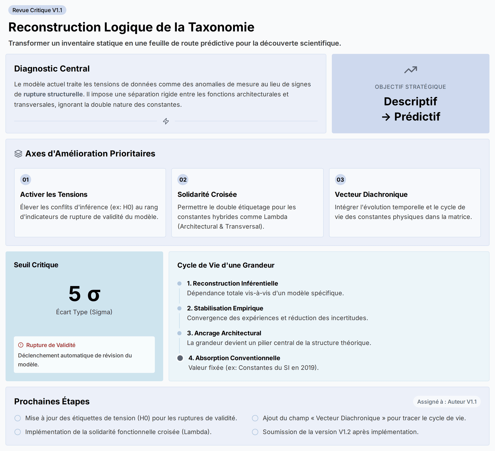

# Source DOCX - Critique_tensions_cosmologiques_v0_1

## Statut

```text
lot: 5 - critiques constructives
source physique: Tensions_cosmologiques_et_taxonomie_des_constantes_physiques-Summary.docx
source physique path: 90_Critiques_ constantes_effectives_stabilisees/00_Sources_docx/Tensions_cosmologiques_et_taxonomie_des_constantes_physiques-Summary.docx
sha256_source: 0005c97c46e121a9d1414a22366945e94c4a1a238837c8c61c2dd75f5b221dcf
statut: extraction DOCX de travail
document actif concerne: Cycle cosmologique; fiche de criblage
controle attendu: Comparaison
```

## Limite

```text
Cette extraction ne remplace pas la source originale.
Elle rend la matiere lisible en Markdown pour comparaison et integration.
La mise en page Word, les equations, tableaux et elements graphiques
peuvent etre restitues de maniere incomplete.
```

> Verifier la source originale avant toute reprise scientifique.
> Convention : [CONVENTION_PLACEHOLDERS.md](../../CONVENTION_PLACEHOLDERS.md)

## Extraction

## Tensions_cosmologiques_et_taxonomie_des_constantes_physiques

------------------------------------------------------------------------



## Synopsis Essentielle

L’équipe d’analyse critique la taxonomie V1.1, reconnaissant son ambition mais identifiant trois failles structurelles qui limitent sa puissance et sa pertinence. Le diagnostic central est que le modèle actuel est trop statique : il traite les tensions de données comme de simples anomalies de mesure, impose une séparation rigide entre les fonctions des constantes physiques, et ignore leur évolution historique. Cette rigidité empêche la taxonomie de fonctionner comme un outil prédictif, la réduisant à un simple inventaire de l’état actuel de la physique. **Nous pensons** que pour qu’une carte soit utile, elle doit non seulement décrire le territoire, mais aussi révéler les forces tectoniques qui le transforment. Les recommandations visent donc à injecter du dynamisme dans le modèle, transformant une base de données statique en une véritable feuille de route pour la découverte scientifique.

## Reconstruction Logique : Améliorer la Matrice V1.1

Le dialogue identifie trois axes d’amélioration pour faire passer la taxonomie V1.1 d’un état descriptif à un état prédictif. Chaque axe cible une rigidité spécifique du modèle actuel et propose une solution concrète.

### 1. Activer les Tensions de Données : De l’Anomalie à l’Indicateur de Rupture

- **Le Statu Quo (La Faille)** : La taxonomie actuelle relègue les tensions de données majeures (comme la divergence sur la constante de Hubble, H0) à une catégorie passive de « conflit d’inférence » ou « propriété du réseau d’accès ». Cela suppose implicitement que le problème vient des outils de mesure, et non du modèle cosmologique lui-même.
- **L’Analogie** : C’est comme observer des microfractures sur une poutre métallique lors d’un test de résistance et conclure que c’est le capteur de pression qui est défectueux, ignorant ainsi un signe de rupture structurelle imminente.
- **La Solution Proposée** : Élever le statut des tensions. Lorsqu’une tension dépasse un seuil statistique critique (ex: 5 sigma), elle doit être automatiquement étiquetée comme « indicateur de rupture de validité ». Cela forcerait un paramètre comme H0 à ne plus être un simple « paramètre d’état », mais potentiellement une « constante de raccordement » entre deux régimes physiques, devenant ainsi un moteur d’évolution du modèle.

### 2. Abattre la Cloison : Vers une Solidarité Fonctionnelle Croisée

- **Le Statu Quo (La Faille)** : La V1.1 impose un mur infranchissable entre les « fonctions architecturales » (qui définissent la structure interne d’un modèle) et les « fonctions transversales » (qui définissent les limites entre les modèles). L’auteur doit choisir un camp, ce qui ampute la réalité de certaines constantes.
- **L’Exemple Clé (Lambda)** : La constante cosmologique (lambda) est *architecturale* dans le modèle Lambda-CDM (elle en est un pilier) mais aussi *transversale* car sa valeur mesurée, en conflit avec la théorie quantique, marque une limite de validité entre la cosmologie et la physique des particules.
- **La Solution Proposée** : Introduire un mécanisme de « solidarité fonctionnelle croisée » (cross-functionality). Cela permettrait un double étiquetage : pour lambda, on cocherait “Terme de fond (Architectural)” en précisant le domaine “Cosmologie”, ET “Seuil de validité (Transversal)” en précisant le domaine “Gravité à basse énergie”. Cette rigueur contextuelle préserve la clarté tout en reflétant la double nature de la constante.

### 3. Intégrer le Temps : L’Axe Diachronique et le Cycle de Vie des Constantes

- **Le Statu Quo (La Faille)** : La matrice est purement synchronique ; elle prend une photographie de l’état actuel des connaissances. Elle ne capture pas le *processus* par lequel une grandeur physique évolue, d’une valeur déduite à une constante conventionnelle (comme pour les constantes du SI en 2019).

- **L’Analogie** : C’est comme cartographier les étoiles sans le diagramme de Hertzsprung-Russell, qui montre leur évolution. Une étoile *devient* une géante rouge ; une constante *devient* conventionnelle.

- **La Solution Proposée** : Ajouter un « vecteur diachronique » (un axe temporel) pour suivre le cycle de vie d’une grandeur à travers quatre phases :

  1.  **Reconstruction inférentielle** (dépendante d’un modèle)
  2.  **Stabilisation empirique forte** (convergence des expériences)
  3.  **Ancrage architectural** (devient un pilier)
  4.  **Absorption conventionnelle** (valeur fixée)

  - *Application* : Pour des paramètres comme la phase delta CP dans la physique des neutrinos, la matrice indiquerait non seulement son statut actuel (“partiellement stabilisé”), mais aussi la condition explicite pour passer à la phase suivante (la résolution du problème de la hiérarchie des masses).

## Prochaines Étapes

**@Auteur de la taxonomie V1.1** :

- [ ] Mettre à jour la matrice pour permettre aux tensions de données (ex: H0) d’être étiquetées comme « indicateur de rupture de validité » lorsque le seuil de confiance statistique est dépassé - \[TBD\]
- [ ] Implémenter un mécanisme de double étiquetage (« solidarité fonctionnelle croisée ») pour les grandeurs hybrides comme la constante cosmologique Lambda - \[TBD\]
- [ ] Ajouter un champ « Vecteur Diachronique » pour tracer le cycle de vie des grandeurs physiques selon les quatre phases proposées (Reconstruction, Stabilisation, Ancrage, Absorption) - \[TBD\]
- [ ] Soumettre la version V1.2 pour une nouvelle revue après implémentation de ces modifications - \[TBD\]
